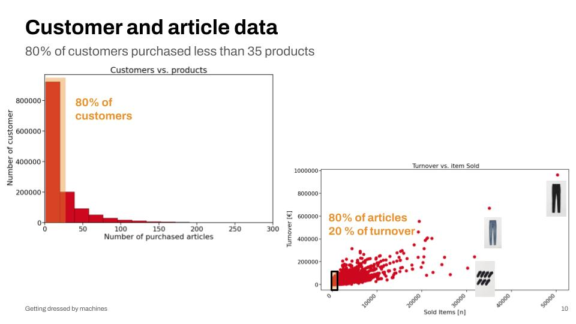
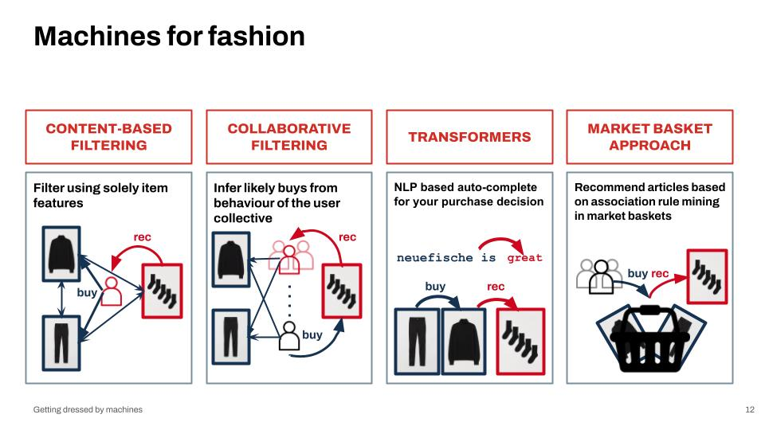

# Fashion recommernder capstoneproject

## Disclaimer: 

!!! This notebook is under construction. Cleaning of the Notebooks, Documentation and Descriptions are in process. Thank you for your understanding. !!!!

## Introduction

Online retailers for fashion products suffer the paradox of choice: With increasing number of articles/choices, customers tend to make less or wrong purchases. This results in less customer satisfaction, more returns and less turnover.

This capstone project deals with the challenging task of creating a recommendation system for a fashion label. This increases customer satisfaction and the sustainability of the sales process, and a targeted recommendation generates significant economic value. In addition, a recommendation system provides valuable insights into customer preferences and forecasting opportunities for stakeholders.
The task is to read customers’ minds without evaluation information based solely on customers’ purchase decisions using cleaver feature engineering and targeted models. An in-depth error analysis was conducted to select an appropriate model, and the winning model was further trained on the proper metric.
In addition to the challenging nature of a recommender system, several additional obstacles were overcome. Starting from a fast adaptation to an unfamiliar subject area, dealing with Big-Data, and targeted feature engineering to acquaint with the yet foreign methodology.
All these efforts were made because “you have the right to look fabulous.”

## Data given

The data was provided by [H&M](https://www.kaggle.com/competitions/h-and-m-personalized-fashion-recommendations/) by their fashion recommendations Kaggel challenge. 

The dataset contains 3 Tables : 

* article meta data
    * 105,542 articles and 25 features
* customer data
    * 1,371,980 customers and 7 features
* transactions table
    * 31,788,324 transactions and 5 features
        20.09.2018 - 22.09.2020

## Final presentation

The results of this capstone project were presented on the 19th of May 2022 during the graduation event of the neue fische data science bootcamp.

The final slides can be accessed [here](./presentation/20220518_Getting-dressed-by-machines_Capstone-project-presentation.pdf).

### Transaction table :

The main table was the transactions table, which connects the article table with the customer table. There every single purchased item is present. An overview is given in the following:

|Column name| Datatyp| Meaning | nunique| annotation|
|----------|-------| ---- |----|---|
|tdat |	object |	Transaction date|	734 | needs to be transformed|
|customerid |	object |	Custumer ID|	1362281| primary key|
|articleid |	int64|	article_id |	104547| secondary key|
|price |	float64 |	price | 	9857| is transformed or different currency|
|saleschannelid |	int64|	2 is online and 1 store|	2| encoding to 0 &1 ?|


### Article Metadata

The article table is describing the 105.542 articles by 25 features in more detail these should be shown in the following: 

|Column name| Datatyp| Meaning | nunique| annotation|
|----------|-------| ---- |----|---|
| [article_id](#articleid) 	|int64 | Id connected to image name| 105542| |
| [product_code](#productcode)	|int64| Overlying product category| 45875| Takes the first 7 digits of the article ID|
| [prod_name](#prodname)	|object |  overall product name | 47224| General product name|
|[product_type_no](#producttypeno)	|int64 | Classificaton after product type number| 132| -1 = unknown = NaN ? = 121||
|[product_type_name](#producttypename)	|object |Classificaton product type label| 131| 131 values + -1 for unknown |
|[product_group_name](#productgroupname)	|object | Product typ categories by name|19| 121 unknown |
| [graphical_appearance_no](#graphicalappearanceno)	| int64| Appearance no| 30| -1 = unknown = NaN ? = 52|
|[graphical_appearance_name](#graphicalappearancename)	|object| Appearance label| 30| |
| [colour_group_code](#colourgroupcode)	|int64| (dominating)Colour group number|50| No closed numbers i.e. 18, 24-29, 34-39 etc. is missing|
| [colour_group_name](#colourgroupname)	|object| (dominating)Colour group label| 50| |
|[perceived_colour_value_id](#perceivedcolourvalueid)	|int64| "gray" scale or lightning condition of the image| 8 | -1 = unknown = NaN? = 28|
|[perceived_colour_value_name](#perceivedcolourvaluename)	|object| description of the lightning condition label| 8 | | |
|[perceived_colour_master_id](#perceivedcolourmasterid)	|int64|color master id | 20 | 17 is missing and -1 = unknown|
|[perceived_colour_master_name](#perceivedcolourmastername)	|object|  label of the color master id |20 | 
|[department_no](#departmentno)	|int64| Department number| 299| More than one department might be responsible for  a certain topic| 
|[department_name](#departmentname)	|object| Department label (topics) |250| |
|[index_code](#indexcode)	|object| "target group classification" index code| 10| A-F|
|[index_name](#indexname)	|object| "target group classification"  index label | 10 | Ladieswear, Menswear etc.| 
|[index_group_no](#indexgroupno)	|int64| Corse "target group classification"  |5| 1,2,3,4,26|
| [index_group_name](#indexgroupname)	|object| Corse "target group classification"  label | 5|  'Ladieswear' = 1 ,'Divided' =2,'Menswear'=3 'Baby/Children' = 4 , 'Sport' =26|
| [section_no](#sectionno)	|int64| "target group classification" + usage numbering| 57| not a closed numbering|
| [section_name](#sectionname)	|object| "target group classification" + usage label| 56| -1 is missing|
| [garment_group_no](#garmentgroupno)	|int64| garnet group no| 21|1002,  1003, 1007 ...1025| 
| [garment_group_name](#garmentgroupname)	|object|garnet group label|21 | | 
| [detail_desc](#detaildesc)	|object| more detailed description| 43404| so not every item as an individual description and 416 NaN values|


### Customer Table

The third table, is the Customer Table. It contains  1,371,980 customers and 7 features. and should be shown in the following. 

|Column name| Datatyp| Meaning | nunique| annotation|
|----------|-------| ---- |----|---|
|[customer_id](#customerid) |	object|	Custumer id|	1371980| hashed Customer Id|
|[FN](#fn)	|float64	|Recievs Fashion News|	1|
|[Active](#active) |	float64	|customer is active for communication|	1| Active = ACTIVE $\downarrow$|
|[club_member_status](#clubmemberstatus)	|object|	club status |	3| ACTIVE = Active ? $\uparrow$|
|[fashion_news_frequency](#fashionnewsfrequency)|	object	|Fashion News frequency	|4| interested in topics |
|[age](#age())	|float64|	age |	84| |
|[postal_code](#postalcode) |object|	Zip code |	352899| Hashed postalcode|

Further investiagtion to the basic data can be found in the notebook Columsdescription.ipynb. 


## Big Data handling

To deal with the big data a cloud service (```Google Cloud Platform)``` was used. The datasets were transformed to [```.parquet files```](https://parquet.apache.org/) ([pyarrow](https://arrow.apache.org/docs/python/index.html)) and loaded into ```Google cloud storage```. In addition ```Bigquery``` was enabled as a Data warehouse, to be adressed with SQL-Queries. For paralizsation of the data wrangling and EDA, the Python library [```dask```](https://dask.org/) was used. 

## Explorative Data Analysis



See lso the following notebooks for more EDA:

* [Initial_EDA_CMM](./notebooks/Initial_EDA_CMM.ipynb)
* [EDA-Martin](./notebooks/EDA-Martin.ipynb)
* [first_eda_sinan](./notebooks/first_eda_sinan.ipynb)

## Models

Four different algorithms plus a baseline model were applied. This chapter introduces the algorithms and gives an overview of the used notebooks.



### Content-basel filtering
This approach tries to find similarities between articles solely based on their features. It recommend articles that are similar to that what a user likes (based on actions or explicit feedback).

@ SINAN: Please list your notebooks and provide short descriptions (see market basket approach) 

### Collaborative filtering
This approach filters articles based on past user-item interactions, in our case this means purchases. The main cf model in this project is an alternating least squares model, i.e., a model that learns 'latent' user and item factors (1280 in standard configuration) respectively, based on the utility matrix derived from the transactions data frame. Similar to the content based approach each factor can be interpreted as an attribute of an item, and the corresponding user factor then is the preference of a user for that attribute. However, in this approach both factors are learned from data by alternating between optimization of the user and item factors, based on how well they can explain the recorded user-item interactions in the utility matrix.

To run the ALS model just go to the root directory of the repo and enter:

python modeling/train_and_predict.py path/to/config.json

Note that the path to the configuration file is optional. If no file is provided the default config.json from the modeling/ directory will be used.

The model will be trained for all test weeks defined in the config file. See modeling/config.json for available options. For the default configuration these are the last 5 weeks of the data. Resulting predictions will be saved in the data/ directory as csv-files. The format is in line with the one required by the associated Kaggle challenge and can be used to submit on Kaggle without further processing. Note: training and prediction can take several hours.

To evaluate the MAP@k for the resulting predictions run:

python modeling/eval.py path/to/config.json

The path to the config file is optional and the default will be used if not provided. Use the same config file that was used in training and predicting. All test weeks will be scored according to the MAP@k (default for k is 12 as per Kaggle challenge). For reference here are the results for the standard configuration:

| submission_file                                                | MAP_at_12
|data/results_ALS_1280_f_0.01_r_30_it_2020-08-26--2020-09-01.csv | 0.01371742561481911  |
|data/results_ALS_1280_f_0.01_r_30_it_2020-09-02--2020-09-08.csv | 0.01647618039373869  |
|data/results_ALS_1280_f_0.01_r_30_it_2020-09-09--2020-09-15.csv | 0.016722822849194158 |
|data/results_ALS_1280_f_0.01_r_30_it_2020-09-16--2020-09-22.csv | 0.01583545858718839  |

Note that the 5th (Kaggle) test week can not be validated, because the data is not public. Submitting it to Kaggle yielded a MAP@12 of 0.01474, consistent with the above results.

### Transformers
This approach is more or less a bridge between NLP and recommender systems and can be explained as a kind of "auto-complete for purchase decisions".

@ MARTIN: Please list your notebooks and provide short descriptions (see market basket approach) 


### Market basket approach
This approach mines for association rules of articles which often appear together in marketbaskets. Instead of using market baskets we decided to apply the algorithm on "wardrobes". A wardrobe is defined by all articles an individual customer has purchased. In our case all articles which appear in the transactions_train dataset and can be assigned to an individual customer id.

The following notebooks are used for this approach:

* [Generate_wardrobe_df_CMM](./notebooks/Generate_wardrobe_df_CMM.ipynb): This notebooks helps to generate a dataframe and csv which stores all wardrobes which can be collected out of the transaction dataset.
* [Marketbasket_Analysis_on_wardrobes_CMM](./notebooks/Marketbasket_Analysis_on_wardrobes_CMM.ipynb): This notebook mines assocation rules out of given wardrobes based on the [apyori](https://pypi.org/project/apyori/) library.
* **WIP**: [Marketbasket_Analysis_on_baskets_CMM](./notebooks/Marketbasket_Analysis_on_baskets_CMM.ipynb): This notebook mines assocation rules based on market baskets. This approach is work-in-progress. The notebook does not include final and applicable code.
* [Marketbasket_Analysis_Build_recommendations_CMM](./notebooks/Marketbasket_Analysis_Build_recommendations_CMM.ipynb): This notebooks generates submission files (csv) with 12 recommendations for each customer_id. Empty fields are filled up with the Top12 sold aricles. The csv can either be used to upload it on kaggle or calculate results with [eval-code](./modeling/eval.py) or [Monetary_value](./notebooks/Monetary_value.ipynb).
* [Monetary_value](./notebooks/Monetary_value.ipynb): This notebook takes a submission-csv and checks which recommendations were actually purchased on the 4 test weeks. Based on this the hitrate, the monetary value of the hits (based on article-prices) and the share of predicted turnover is calculated. Finally, the results are stored in a csv.

### Additional model: Top12 most sold articles in age-clusters

While our original baseline model takes the Top12 most sold articles of the entire customer base, this approach calculates the Top12 most sold articles of specific age-groups of the customers. See [Top12_clusters](./notebooks/Top12_clusters.ipynb) for the code.


## Additional notebooks:

...tbd


